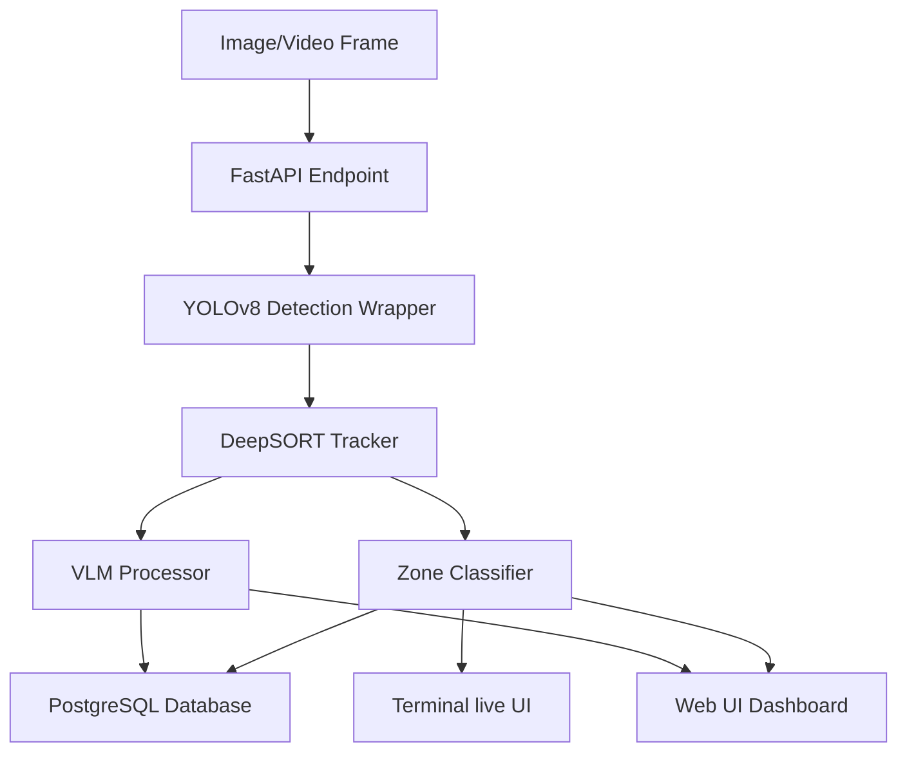
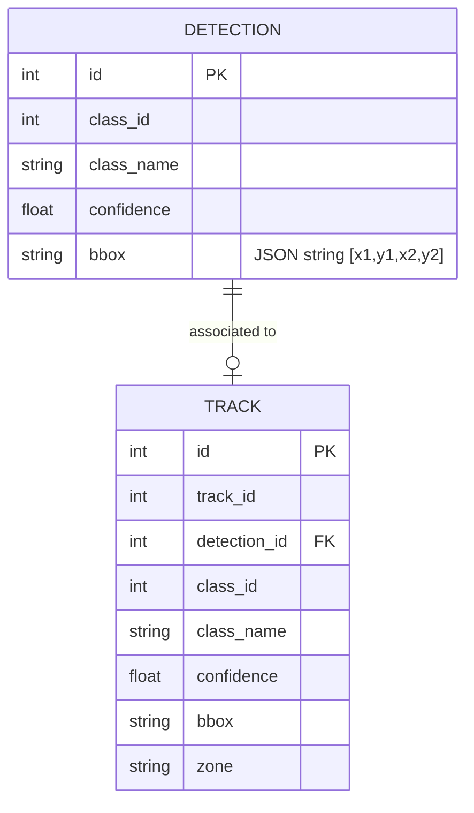

# Store Intelligence Pipeline Architecture

This document describes the design, data flow, and components of the Store Intelligence edge AI system.

## System Components

### 1. API Service (`api/`)
* **`api/main.py`**: The entrypoint for the FastAPI backend. Configures CORS and handles startup lifecycles (DB initialization). It instantiates shared models on memory once to prevent GPU allocation overhead.
* **`api/db.py`**: Configures the async SQLAlchemy/SQLModel connection pool using asyncpg and defines the schema:
  * **`Detection`**: Holds bounding boxes, class ids, and confidence scores.
  * **`Track`**: Holds persistent object identifiers, associated detections, and spatial retail zones.
* **`api/routers/`**:
  * `/detect`: Returns instant YOLOv8 object boundaries and writes metadata to the DB.
  * `/track`: Updates track states using DeepSORT, assigns objects to spatial zones, and updates DB tables.

### 2. Edge AI Pipeline (`pipeline/`)
* **`pipeline/detect.py`**: Integrates the Ultralytics YOLOv8 engine. It wraps model output into structured `DetectionResult` objects.
* **`pipeline/track.py`**: Integrates standard DeepSORT tracking with PyTorch OSNet Re-ID. It preserves tracking identities across frames and matches bounding boxes.
* **`pipeline/zone_classifier.py`**: Implements custom polygon zone logic. Using OpenCV’s `pointPolygonTest`, it maps bounding box footprints to spatial coordinates (e.g., checkout queue, aisles, shelf fronts).
* **`pipeline/vlm_processor.py`**: Implements mock-capable Visual Language Model scene queries using HuggingFace's transformers library, enabling cognitive text descriptions of customer behaviors and inventory stock levels.

### 3. User Interfaces (`ui/`)
* **Web UI Dashboard (`ui/web`)**: Built using Vite + React. Includes an interactive canvas overlaying bounding boxes, persistent tracking logs, live analytics statistics (Shoppers count, shelf inventory congestion status), and a VLM prompt processor. Features a premium dark glassmorphic design.
* **Terminal UI Console (`ui/terminal`)**: A CLI dashboard built with the `rich` library. Features active console layouts, occupancy indicators, real-time live events, and a backup local simulator mode.

## Database Schema

## Edge AI Design Decisions

1. **Shared GPU Context**: The model weights (`YOLOv8` and `OSNet`) are loaded once during router/application instantiation, keeping inference loops fast by reusing memory.
2. **Resilient Database Fallback**: Database inserts are wrapped in exception blocks. If the PostgreSQL container is offline or unreachable, the endpoints fall back to local processing seamlessly without crashing.
3. **Mock Mode Execution**: The UI includes a manual togglable Mock Mode allowing full visualization of real-time behaviors without a CUDA-capable GPU.
